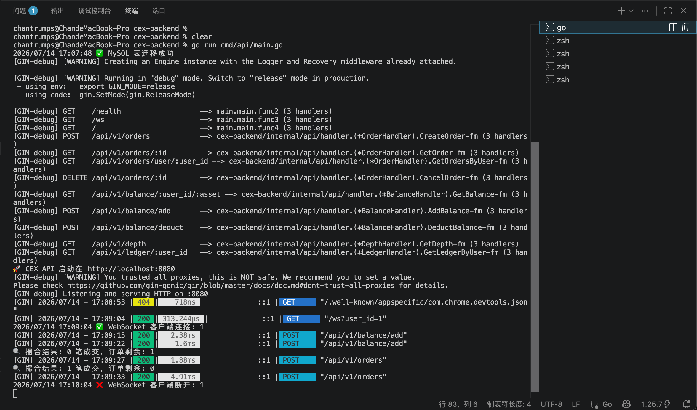
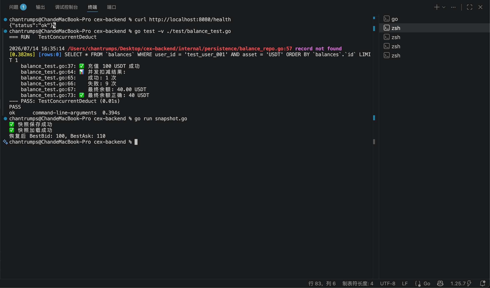
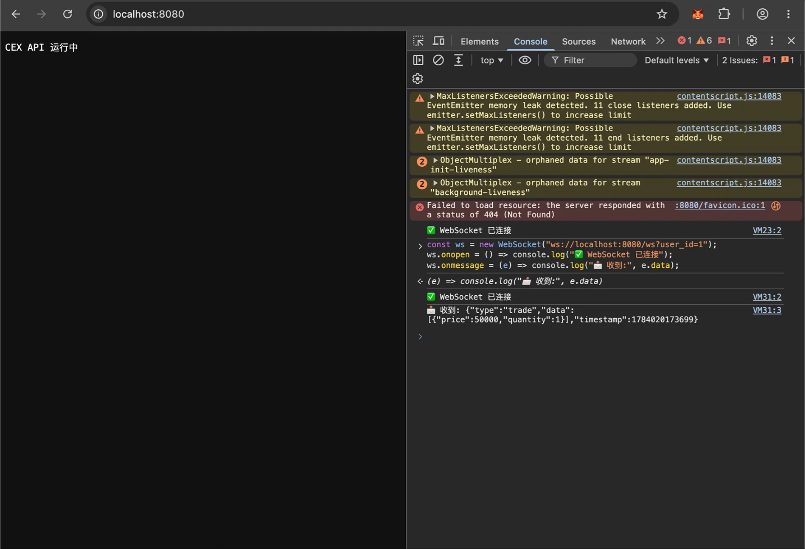
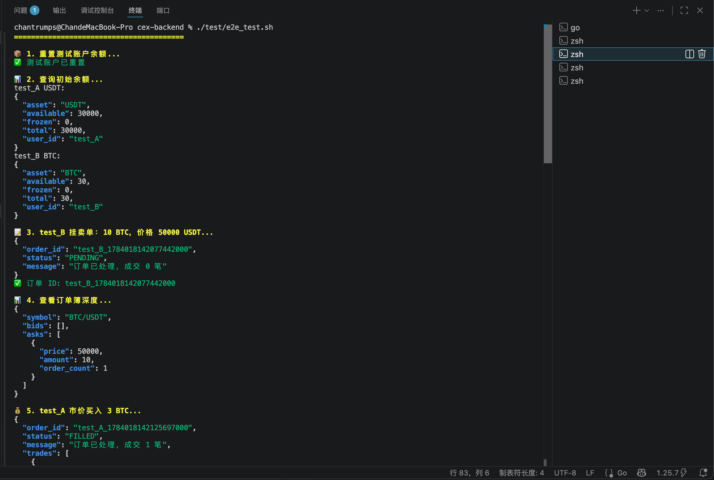
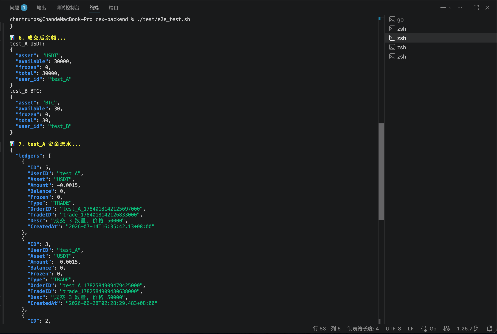
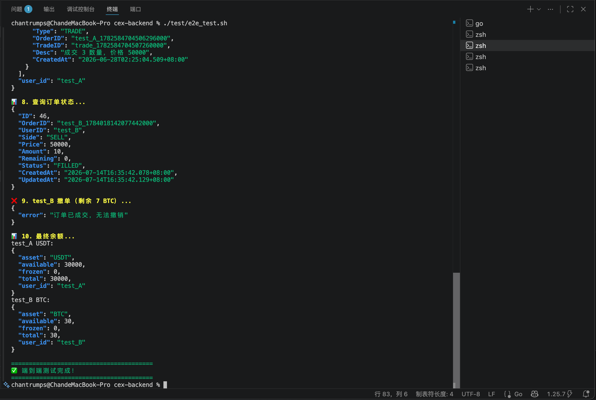

# 🏛️ CEX Backend

一个基于 Go 的高性能中心化交易所后端，包含**内存订单簿**、**撮合引擎**、**WebSocket 实时推送**和 **Redis 快照恢复**。

> 该项目为个人独立开发，用于展示 Go 后端开发、系统设计和工程化能力。

---

## 📋 目录

- [技术栈](#-技术栈)
- [已完成功能](#-已完成功能)
- [项目结构](#-项目结构)
- [快速启动](#-快速启动)
- [运行截图](#-运行截图)
- [测试](#-测试)
- [后续规划](#-后续规划)

---

## 🛠 技术栈

| 层 | 技术 |
|---|---|
| **语言** | Go 1.25.6 |
| **Web 框架** | Gin v1.12.0 |
| **数据库** | MySQL 8.0（GORM v1.31.2） |
| **缓存 / 快照** | Redis 9.x（go-redis/v9） |
| **实时推送** | WebSocket（gorilla/websocket） |
| **依赖管理** | Go Modules |

---

## ✨ 已完成功能

### REST API
- ✅ 下单（限价单 / 市价单）
- ✅ 查询订单 / 订单列表
- ✅ 撤单
- ✅ 查询订单簿深度（买盘 / 卖盘）
- ✅ 查询用户余额
- ✅ 查询资金流水

### 撮合引擎（内存）
- ✅ 多交易对支持（BTC/USDT、ETH/USDT 等）
- ✅ 限价单价格检查
- ✅ 市价单立即成交
- ✅ 循环撮合，直至无法成交
- ✅ 并发安全（读写锁）

### 数据持久化
- ✅ 订单历史（orders）
- ✅ 成交记录（trades）
- ✅ 用户余额（balances，含乐观锁扣减）
- ✅ 资金流水（ledgers）

### 实时推送（WebSocket）
- ✅ 成交推送（Trade）
- ✅ 订单状态变更推送（Order）
- ✅ 心跳保活（Ping / Pong）

### 高可用设计
- ✅ Redis 快照：每 5 秒自动保存订单簿，服务重启后自动恢复
- ✅ 乐观锁防并发超卖

---

## 📁 项目结构

```
cex-backend/
├── cmd/api/                 # 服务入口
├── internal/
│   ├── api/                 # Handler + Service
│   │   ├── handler/         # HTTP 处理层
│   │   └── service/         # 业务逻辑层
│   ├── engine/              # 订单簿 + 撮合引擎 + 快照
│   ├── persistence/         # MySQL 操作
│   └── websocket/           # Hub + Client + 消息广播
├── test/                    # 单元测试 + 端到端测试
├── screenshots/             # 运行截图
├── go.mod
└── go.sum
```

---

## 🚀 快速启动

### 1. 启动 MySQL 和 Redis

```bash
docker run -d --name mysql-cex -e MYSQL_ROOT_PASSWORD=root -p 3306:3306 mysql:8.0
docker run -d --name redis-cex -p 6379:6379 redis:alpine
```

### 2. 创建数据库

```bash
mysql -u root -p -e "CREATE DATABASE IF NOT EXISTS cex CHARACTER SET utf8mb4 COLLATE utf8mb4_unicode_ci;"
```

### 3. 启动服务

```bash
go mod tidy
go run cmd/api/main.go
```

### 4. 测试 API

```bash
# 健康检查
curl http://localhost:8080/health

# 下单
curl -X POST http://localhost:8080/api/v1/orders \
  -H "Content-Type: application/json" \
  -d '{"user_id":"1","symbol":"BTC/USDT","side":"BUY","price":50000,"amount":1}'
```

---

## 📸 运行截图








---

## 🧪 测试

### 单元测试（乐观锁并发扣减）

```bash
go test -v ./test/balance_test.go
```

**结果**：✅ 10 个并发请求扣减 60，只有 1 个成功，最终余额 40，乐观锁生效。

### 端到端集成测试

```bash
chmod +x test/e2e_test.sh
./test/e2e_test.sh
```

**结果**：✅ 充值 → 挂单 → 撮合 → 查深度 → 查流水 → 撤单，全流程通过。

### Redis 快照测试

```bash
go run snapshot.go
```

**结果**：✅ 快照保存成功，加载成功，订单簿恢复正确。

---

## 📋 后续规划

- [ ] Docker 容器化部署（Dockerfile + docker-compose）
- [ ] RabbitMQ 集成：跨系统消息广播
- [ ] CICD 自动化部署（GitHub Actions）
- [ ] Prometheus + Grafana 监控指标
- [ ] 订单簿增量推送（降低带宽消耗）