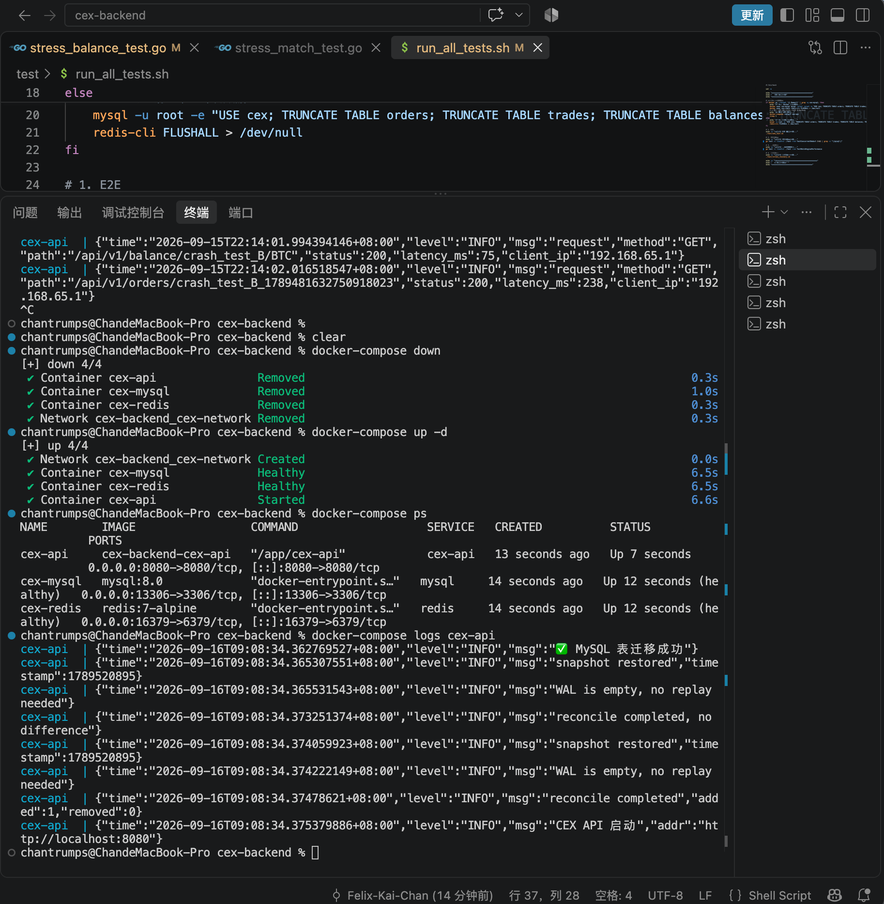
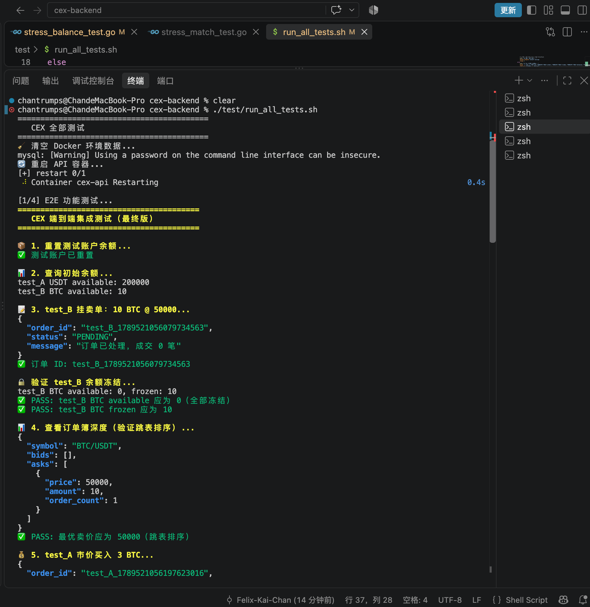
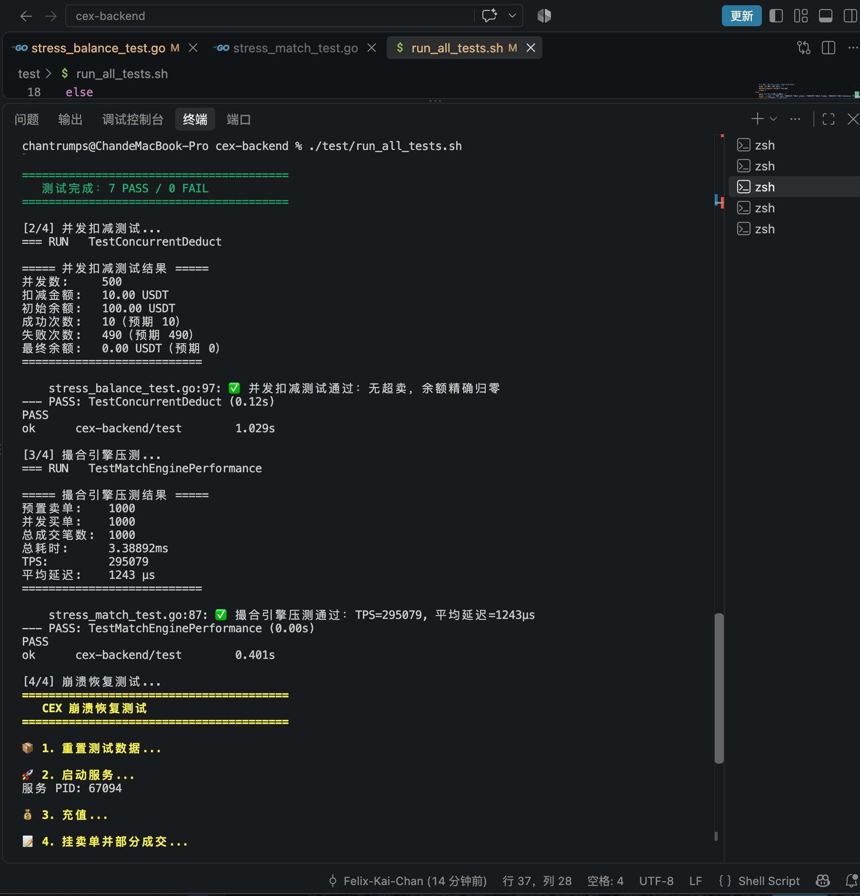
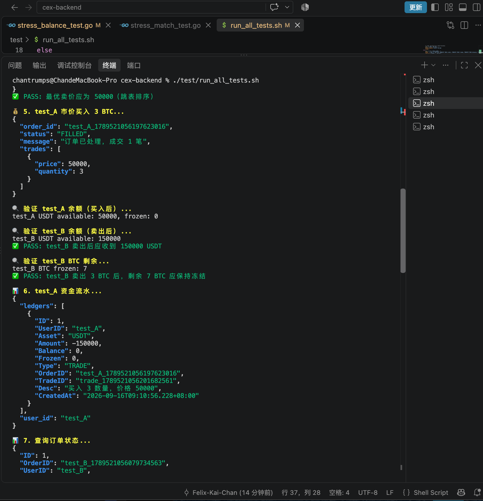
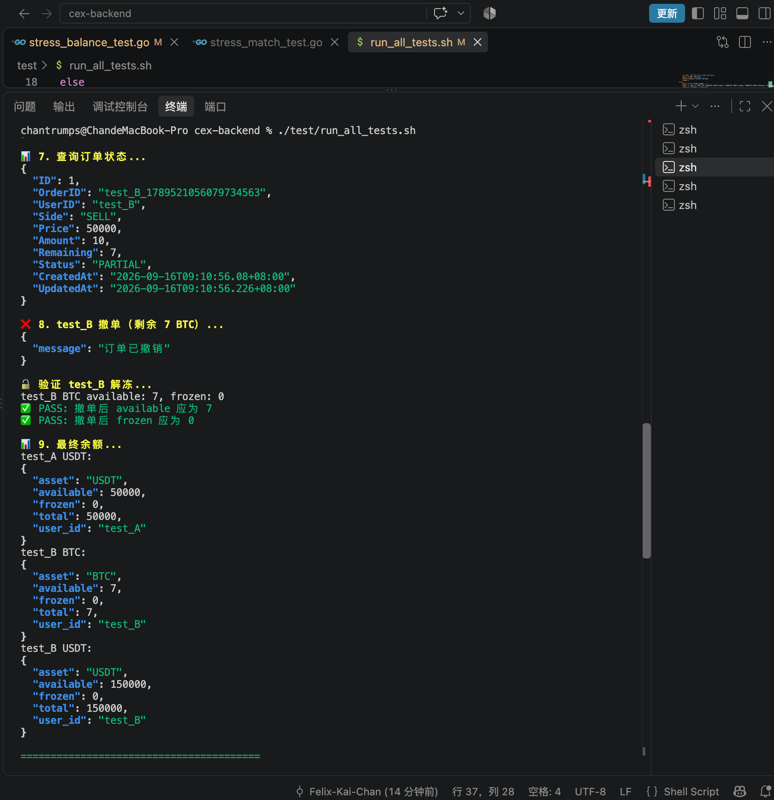
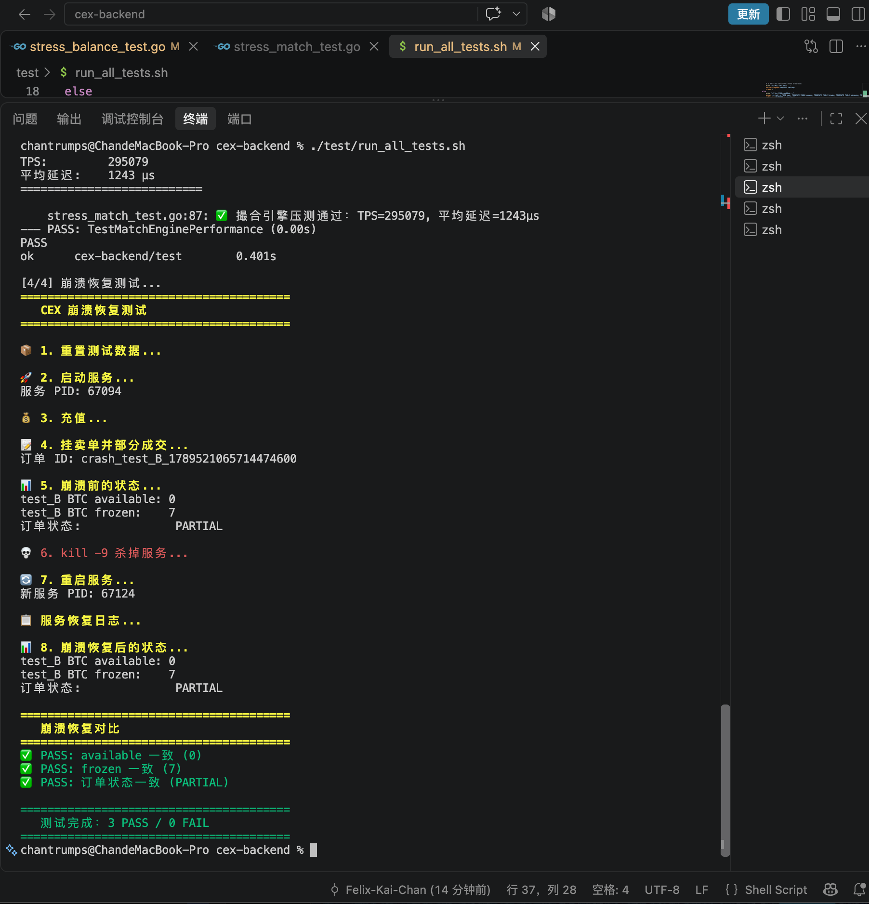

```markdown
# 🏛️ CEX Backend

一个基于 Go 实现的中小规模中心化交易所后端系统。

**核心特性：**

-  **内存撮合引擎** — 跳表 + 链表，最优价 O(1)
-  **并发安全余额管理** — 条件更新，无超卖
-  **三层持久化恢复** — Redis 快照 + WAL + MySQL 对账
-  **结构化日志** — slog JSON 输出
-  **Docker 一键部署** — 多阶段构建 + healthcheck
-  **完整测试体系** — E2E + 并发 + 压测 + 崩溃恢复

> 技术栈：Go · MySQL · Redis · Docker

---

## 📋 目录

- [技术栈](#-技术栈)
- [系统架构](#-系统架构)
- [核心功能](#-核心功能)
- [项目结构](#-项目结构)
- [快速启动](#-快速启动)
- [API 接口](#-api-接口)
- [测试](#-测试)
- [踩坑记录](#-踩坑记录)
- [后续规划](#-后续规划)

---

## 🛠 技术栈

| 模块 | 技术 |
| :--- | :--- |
| 编程语言 | Go 1.25 |
| Web 框架 | Gin |
| ORM | GORM |
| 数据库 | MySQL 8.0 |
| 缓存 / 状态恢复 | Redis 7.x |
| Redis 客户端 | go-redis/v9 |
| WebSocket | gorilla/websocket |
| 日志 | log/slog（JSON 结构化） |
| 容器化 | Docker + Docker Compose |
| 依赖管理 | Go Modules |

---

## 📐 系统架构

```text
User / Client（Web / Mobile）
│
▼
┌─────────────────────────────────────────────────────────────┐
│ API 层（Gin）                                               │
│ ├── 中间件（JWT / 限流 / 日志 / CORS）                      │
│ ├── Handler：解析参数、调用 Service                         │
│ ├── WebSocket Hub：实时推送 + 断线重连补发                  │
│ └── RequestLogger：slog JSON 结构化请求日志                 │
└─────────────────────────────────────────────────────────────┘
│
▼
┌─────────────────────────────────────────────────────────────┐
│ Service 层（order.go）                                      │
│ ├── 校验：user_id / side / price / amount                   │
│ ├── 冻结：FreezeBalance（条件更新，原子）                   │
│ ├── 撮合：调用 Engine.Match()                               │
│ ├── 双边扣减：买方 + 卖方都处理                             │
│ └── 双边流水：ledger.Record × 2                             │
└─────────────────────────────────────────────────────────────┘
│
▼
┌─────────────────────────────────────────────────────────────┐
│ Engine 层（match.go / orderbook.go / skiplist.go）          │
│ ├── OrderBook：每个交易对独立                               │
│ ├── 跳表（SkipList）：最优价 O(1)                           │
│ ├── 链表（OrderList）：同价格 FIFO                          │
│ └── 撮合：价格优先 + 时间优先 + 部分成交                    │
└─────────────────────────────────────────────────────────────┘
│
▼
┌─────────────────────────────────────────────────────────────┐
│ Persistence 层                                              │
│ ├── MySQL：orders / trades / balances / ledgers             │
│ ├── Redis 快照：每 5 秒保存 OrderBook                       │
│ └── WAL 操作日志：每次变更追加                              │
└─────────────────────────────────────────────────────────────┘
```

---

## ✨ 核心功能

### 1. 内存撮合引擎

- **数据结构**：`map[int64]*OrderList` + 跳表（SkipList）
- **最优价**：跳表头节点，O(1)
- **时间优先**：同价格链表 FIFO
- **部分成交**：支持
- **多交易对**：每个交易对独立 OrderBook

### 2. 并发安全余额管理

```sql
UPDATE balances
SET available = available - ?
WHERE user_id = ? AND available >= ?
```

- **原子条件更新**：数据库级别保证不超卖
- **RowsAffected 判断**：0 表示余额不足
- **冻结 / 解冻 / 扣减**：全部条件更新

### 3. 三层持久化恢复

| 层 | 机制 | 用途 |
| :--- | :--- | :--- |
| 1 | Redis 快照 | 每 5 秒保存 OrderBook |
| 2 | WAL 操作日志 | 每次变更追加 |
| 3 | MySQL 对账 | 重启后补入/移除差异 |

### 4. WebSocket 实时推送

- 成交通知 / 订单状态变更
- 心跳检测（60 秒读超时）
- 断线重连 + 历史消息补发

### 5. 结构化日志

```json
{"time":"...","level":"INFO","msg":"match completed","order_id":"...","trades":1}
{"time":"...","level":"INFO","msg":"request","method":"POST","path":"/api/v1/orders","status":200}
```

---

## 📁 项目结构

```text
cex-backend/
├── Dockerfile                  # 多阶段构建
├── docker-compose.yml          # 3 容器编排
├── .dockerignore
├── cmd/api/main.go             # 入口
├── internal/
│   ├── api/
│   │   ├── handler/            # HTTP Handler
│   │   └── service/            # 业务逻辑
│   ├── engine/
│   │   ├── orderbook.go        # 订单簿（map + 链表 + 跳表）
│   │   ├── match.go            # 撮合逻辑
│   │   ├── skiplist.go         # 跳表实现
│   │   └── snapshot.go         # 快照 + WAL + 对账
│   ├── persistence/
│   │   ├── db.go               # 连接池配置
│   │   ├── balance_repo.go     # 余额操作（条件更新）
│   │   ├── order_repo.go       # 订单
│   │   ├── trade_repo.go       # 成交
│   │   └── ledger_repo.go      # 流水
│   └── websocket/
│       ├── hub.go              # 连接管理 + 重连补发
│       ├── client.go           # 单个连接
│       └── message.go          # 消息结构
├── test/
│   ├── e2e_test.sh             # E2E 功能测试
│   ├── stress_balance_test.go  # 并发扣减
│   ├── stress_match_test.go    # 撮合压测 + benchmark
│   ├── stress_recovery.sh      # 崩溃恢复
│   └── run_all_tests.sh        # 一键跑全部
├── screenshots/                # 测试截图
├── go.mod
└── go.sum
```

---

## 🚀 快速启动

### Docker Compose（推荐）

```bash
# 1. 启动全部服务
docker-compose up -d

# 2. 查看容器状态
docker-compose ps

# 3. 查看 API 日志
docker-compose logs cex-api

# 4. 健康检查
curl http://localhost:8080/health
# {"status":"ok"}
```



**服务端口：**

| 服务 | 宿主机端口 | 容器端口 |
| :--- | :--- | :--- |
| CEX API | 8080 | 8080 |
| MySQL | 13306 | 3306 |
| Redis | 16379 | 6379 |

### 本地运行

```bash
# 1. 启动 MySQL
docker run -d --name mysql-cex \
  -e MYSQL_ROOT_PASSWORD=root \
  -p 3306:3306 mysql:8.0

# 2. 启动 Redis
docker run -d --name redis-cex \
  -p 6379:6379 redis:7

# 3. 创建数据库
mysql -u root -e "CREATE DATABASE cex;"

# 4. 启动服务
go mod tidy
go run cmd/api/main.go
```

---

## 📡 API 接口

| 方法 | 路径 | 用途 |
| :--- | :--- | :--- |
| GET | `/health` | 健康检查 |
| POST | `/api/v1/orders` | 创建订单 |
| GET | `/api/v1/orders/:id` | 查询订单 |
| GET | `/api/v1/orders/user/:user_id` | 查询用户订单 |
| DELETE | `/api/v1/orders/:id` | 撤单 |
| GET | `/api/v1/balance/:user_id/:asset` | 查询余额 |
| POST | `/api/v1/balance/add` | 充值 |
| POST | `/api/v1/balance/deduct` | 扣款 |
| GET | `/api/v1/depth` | 查询深度 |
| GET | `/api/v1/ledger/:user_id` | 查询流水 |
| GET | `/ws` | WebSocket |

**示例：下单**

```bash
curl -X POST http://localhost:8080/api/v1/orders \
  -H "Content-Type: application/json" \
  -d '{
    "user_id": "user_A",
    "symbol": "BTC/USDT",
    "side": "BUY",
    "order_type": "LIMIT",
    "price": 50000,
    "amount": 1
  }'
```

---

## 🧪 测试

### 一键跑全部测试

```bash
chmod +x test/run_all_tests.sh
./test/run_all_tests.sh
```



### 1. E2E 端到端测试

```bash
./test/e2e_test.sh
```

**测试结果：** 7 PASS / 0 FAIL

**覆盖场景：** 充值 → 挂单 → 深度 → 撮合 → 双边扣减 → 撤单 → 解冻





### 2. 并发扣减测试

```bash
go test -v -count=1 ./test -run TestConcurrentDeduct 2>&1 | grep -v "\[mysql\]"
```

**测试结果：**

- 500 goroutine 同时扣 10 USDT
- 10 成功、490 失败
- 余额精确归零，无超卖

### 3. 撮合引擎压测

```bash
go test -v -count=1 ./test -run TestMatchEnginePerformance
```

**测试结果：**

- 1000 并发买单
- TPS 29.5 万
- 平均延迟 1.2ms

### 4. 撮合基准测试

```bash
go test -bench=BenchmarkMatch -benchtime=10s ./test
```

**测试结果：** 单次撮合 368 ns/op

### 5. 崩溃恢复测试

```bash
./test/stress_recovery.sh
```

**测试结果：** 3 PASS / 0 FAIL

- `kill -9` 后重启
- 冻结余额和订单状态完全一致



---

## 🐛 踩坑记录

### 坑 1：双边余额 bug（最严重）

- **现象**：E2E 测试发现 test_A 买入后，test_B 没收到 USDT。150000 USDT 凭空消失。
- **根因**：成交循环只处理了 order.UserID，对手方没处理。
- **修复**：Trade 结构体新增 BuyUserID / SellUserID，成交时双边扣减 + 双边流水 + 双边订单状态更新。

### 坑 2：对手方订单状态不更新

- **现象**：卖方订单部分成交后，状态一直 PENDING。
- **根因**：成交时只更新当前订单状态，没更新对手方。
- **修复**：从 DB 读取对手订单，根据实际 Remaining 更新状态。

### 坑 3：created_at 类型转换失败

- **现象**：重启服务时对账失败，`converting driver.Value type time.Time to a int64`。
- **根因**：SQL 用 int64 接收 MySQL 的 DATETIME。
- **修复**：改成 time.Time，取 `.UnixMilli()`。

### 坑 4：最优价 O(n)

- **现象**：早期版本遍历 map 找最优价，O(n)。
- **修复**：引入跳表，最优价 O(1)，插入/删除 O(log n)。

### 坑 5：Redis 快照残留干扰测试

- **现象**：清空 Redis 后跑 E2E 仍然失败。
- **根因**：API 容器的内存 OrderBook 没清空，5 秒后又被写回 Redis。
- **修复**：清空数据后 `docker-compose restart cex-api`。

### 坑 6：Docker 构建网络超时

- **现象**：`apk add` 和 `go mod download` 超时。
- **修复**：Docker 构建时指定代理：

```bash
docker-compose build \
  --build-arg HTTP_PROXY=socks5://host.docker.internal:7897 \
  --build-arg HTTPS_PROXY=socks5://host.docker.internal:7897
```

---

## 📋 后续规划

- [ ] Prometheus + Grafana 监控
- [ ] GitHub Actions CI/CD
- [ ] RabbitMQ 异步消息系统
- [ ] Redis Pub/Sub 多节点扩展
- [ ] OrderBook 增量深度推送
- [ ] 行情服务独立化
- [ ] Kubernetes 生产级部署

---

## 📄 License

MIT License
```
